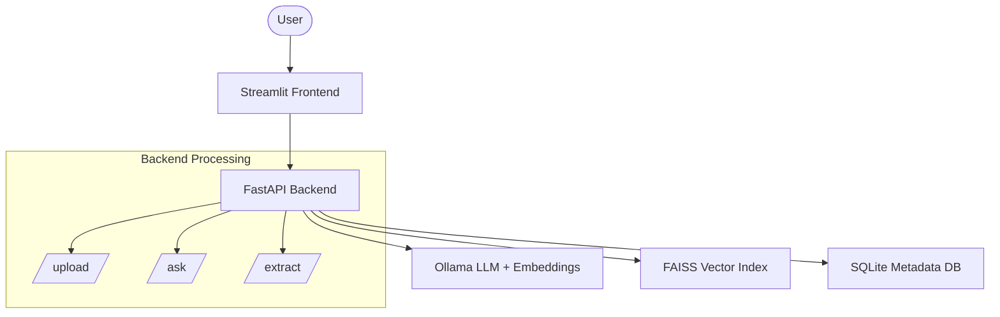

# 📄 Ultra Doc-Intelligence

**Local-First AI Assistant for Logistics Document Automation**

Ultra Doc-Intelligence is a powerful, privacy-focused tool designed to streamline logistics workflows. By leveraging local Large Language Models (LLMs) via Ollama, it enables users to process shipping documents—such as Rate Confirmations, Bills of Lading (BOL), and Invoices—without any data leaving their local environment.

---

## 🚀 Key Capabilities

- **Natural Language Q&A**: Ask complex questions about your shipping documents and get precise, grounded answers.
- **Structured Data Extraction**: Automatically transform unstructured document text into clean, validated JSON (Shipment IDs, rates, dates, etc.).
- **Local-First Privacy**: No API keys, no cloud costs, and absolute data sovereignty—all processing happens on your machine.
- **Explainable AI**: Every answer is traced back to specific document segments with similarity scores for easy verification.

---

## 🏗️ System Architecture

The system is built on a modern RAG (Retrieval-Augmented Generation) pipeline optimized for local performance.



### API Endpoints

| Endpoint | Description |
|----------|-------------|
| `POST /upload` | Parses document text, generates recursive chunks, computes embeddings, and indexes in FAISS. |
| `POST /ask` | Executes semantic search across indexed chunks and generates grounded answers using `llama2`. |
| `POST /extract` | Performs targeted extraction of 11+ logistics-standard fields using the document's full context. |

---

## 🛠️ Technology Stack

| Layer | Component | Rationale |
|-------|-----------|-----------|
| **LLM** | `llama2` (via Ollama) | Proven performance for local inference with low latency. |
| **Embeddings** | `nomic-embed-text` | State-of-the-art local embeddings with 768-dimensional precision. |
| **Vector Engine** | FAISS (IndexFlatIP) | High-speed exact vector matching tailored for document-scale search. |
| **Backend** | FastAPI | Asynchronous performance with automatic OpenAPI documentation. |
| **Frontend** | Streamlit | Rapid prototyping with a clean, interactive user interface. |
| **Parsing** | PyMuPDF & python-docx | Robust text extraction from diverse document formats. |

---

## 🧠 Core Mechanisms

### Smart Recursive Chunking
Documents are split into segments of ~500 characters with a 100-character overlap.
- **Boundary Awareness**: Unlike naive splitters, our system respects paragraph breaks, sentence endings, and punctuation to keep context intact.
- **Precision**: 500 characters is the "sweet spot" for logistics docs, capturing complete address blocks or rate lines without diluting relevance.

### Semantic Retrieval
1. Questions are embedded using the same model as the document chunks.
2. FAISS identifies the **Top 5** most relevant segments using cosine similarity.
3. Chunks below a **0.25 similarity threshold** are automatically rejected before reaching the LLM.

---

## 🛡️ Multi-Layer Guardrails
Built for enterprise trust, the system features a three-tier validation process to eliminate hallucinations:

1. **Pre-Generation Filter**: Discards low-similarity chunks. If no relevant context is found, the system refuses to answer.
2. **Context-Strict Prompting**: The LLM is strictly instructed to use only the provided context and never infer outside knowledge.
3. **Post-Generation confidence Gate**: Answers are analyzed for confidence based on:
   - **Retrieval Similarity** (40%)
   - **Chunk Agreement** (30%)
   - **Answer Coverage** (30%) — *Flags any generated words not present in the source text.*

---

## 📋 Structured extraction Example
The system extracts standard logistics fields with zero guesswork:

```json
{
  "shipment_id": "LD-2024-0847",
  "shipper": "Acme Manufacturing Inc",
  "consignee": "Global Retail Distribution",
  "pickup_datetime": "January 20, 2024 08:00 AM",
  "delivery_datetime": "January 22, 2024 02:00 PM",
  "equipment_type": "Dry Van 53ft",
  "mode": "FTL",
  "rate": "2850",
  "currency": "USD",
  "weight": "42,000 lbs",
  "carrier_name": "Swift Transportation"
}
```

---

## ⚙️ Installation & Setup

### 1. Prerequisites
- **Python 3.10+**
- **Ollama**: [Download here](https://ollama.com/download)

### 2. Setup Repository
```bash
git clone https://github.com/yourusername/ultra-doc-intelligence.git
cd ultra-doc-intelligence

# Initialize virtual environment
python -m venv .venv

# Activate environment (Windows)
.\.venv\Scripts\Activate.ps1

# Activate environment (Mac/Linux)
# source .venv/bin/activate

# Install dependencies
pip install -r requirements.txt
```

### 3. Initialize Models
```bash
ollama pull llama2
ollama pull nomic-embed-text
```

### 4. Run Application
Open two terminal windows:

**Terminal 1 (Backend)**:
```bash
uvicorn backend.app:app --reload --port 8000
```

**Terminal 2 (Frontend)**:
```bash
streamlit run frontend/frontend.py
```
*Access the UI at `http://localhost:8501`*

---

## 📂 Project Structure
```text
ultra-doc-intelligence/
├── backend/            # Core logic and RAG pipeline
├── frontend/           # Streamlit UI implementation
├── tests/              # Comprehensive unit tests
├── uploads/            # Temporary document storage
├── indices/            # Persistent FAISS vector indices
├── requirements.txt    # Project dependencies
└── README.md           # Documentation
```

---

## ⚠️ Known Limitations
- **Scanned Documents**: No native OCR support; requires text-searchable PDFs.
- **Table Complexity**: Intricate PDF table structures may lose spatial context.
- **Context Length**: Extraction is optimized for the first 15,000 characters.
- **Ambiguity**: Multiple conflicting rates in a single document may require specific wording in questions.

---

## 🗺️ Roadmap
- [ ] **OCR Engine**: Add Tesseract/Azure integration for scanned files.
- [ ] **Advanced Padding**: Table-aware parsing algorithms (Camelot/Tabula).
- [ ] **Hybrid Retrieval**: Combine Vector search with BM25 keyword matching.
- [ ] **Cross-Document Search**: Enable querying across multiple uploaded files.
- [ ] **Async Processing**: Background indexing for large document batches.


